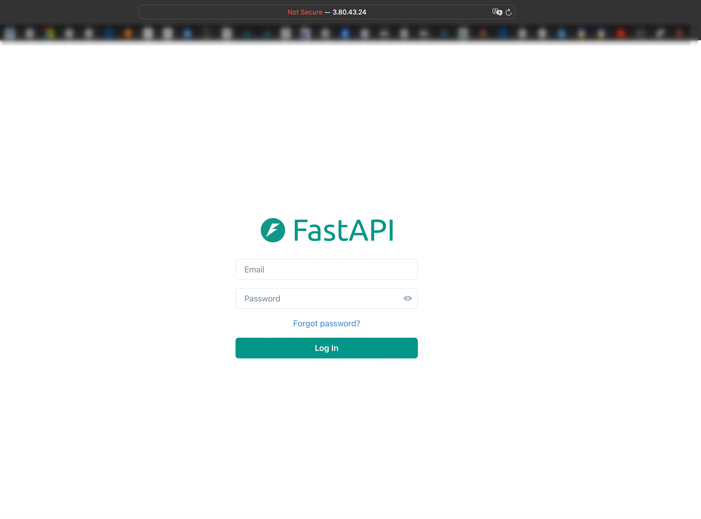
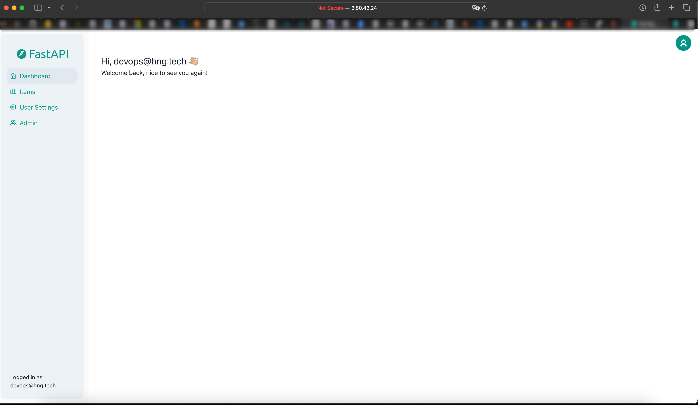
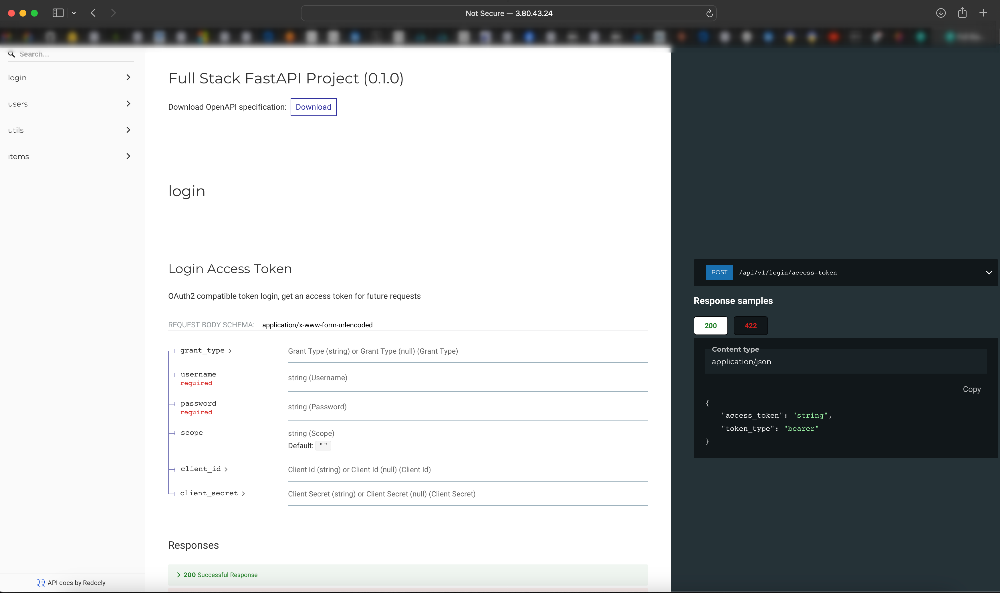

# Full-Stack FastAPI and React Template

Welcome to the Full-Stack FastAPI and React template repository. This repository serves as a demo application for interns, showcasing how to set up and run a full-stack application with a FastAPI backend and a ReactJS frontend using ChakraUI.

## Project Structure

The repository is organized into two main directories:

- **frontend**: Contains the ReactJS application.
- **backend**: Contains the FastAPI application and PostgreSQL database integration.

Each directory has its own README file with detailed instructions specific to that part of the application.

## Getting Started

To get started with this template, please follow the instructions in the respective directories:

- [Frontend README](./frontend/README.md)
- [Backend README](./backend/README.md)

Full Stack Web Application Deployment with Docker
This repository contains a full stack web application with a React frontend, FastAPI backend, and PostgreSQL database. The application is containerized using Docker and uses Nginx Proxy Manager to manage the proxy settings.

#

**Table of Contents**

- [Getting Started]()
- [Requirements](requirement)
- [Prerequisites](prerequisites)
- [Installation](installation)
- [Frontend README](./frontend/README.md)
- [Backend README](./backend/README.md)
- [Proxy Manager Setup](./proxy-manager/README.md)
- [Cloud Deployment README](./cloud-deployment/README.md)
- [Testing and Evaluation README](./testing-and-evaluation/README.)

**Prerequisites**

- Clone the repository
- Install Docker and Docker Compose
- Create an AWS EC2 instance
- Point your domain to the EC2 instance's public IP address

**Step1**:- Clone the repo

```bash
git clone https://github.com/hngprojects/devops-stage-2
cd devops-stage-2
```

**Step2**: Configure the backend

The frontend of this application depends on the backend for full functionality so we will begin by configuring the backend.

```bash
cd backend
```

Dependencies
The backend depends on a postgresQL database, It would also require poetry to be installed before starting up

Installing Poetry

To install Poetry, follow these steps:

```bash
curl -sSL https://install.python-poetry.org | python3 -
```

Add Poetry to your PATH if it's not automatically added:

```bash
source $HOME/.poetry/env
OR try the below:👇🏽
export PATH="$HOME/.poetry/bin:$PATH" >> ~/.bashrc
source ~./bashrc
poetry --version
```

Replace $HOME/.poetry/bin with the appropriate path where Poetry binaries are installed if different on your system. This ensures you can run Poetry commands from any directory in your terminal session.

Install the dependencies

```bash
poetry install
```

Setup PostgreSQL:

Follow these steps to install PostgreSQL on Linux and configure a user named app with password my_password and a database named app. Give all permissions of the app database to the app user.

Install PostgreSQL on Linux (example for Ubuntu):

```bash
sudo apt update
sudo apt install postgresql postgresql-contrib
```

Switch to the PostgreSQL user and access the PostgreSQL

```bash
sudo -i -u postgres
psql
```

Create a user named app with password my_password

```bash
CREATE USER app WITH PASSWORD 'my_password';
```

Create a database named app

```bash
CREATE DATABASE app;
```

Grant all permissions of the app database to the app user

```bash
GRANT ALL PRIVILEGES ON DATABASE app TO app;
```

Exit the PostgreSQL prompt and switch back to the default user

```bash
\q
exit
```

Set database credentials
Edit the PostgreSQL environment variables located in the .env file. Make sure the credentials match the database credentials you just created.

```bash
POSTGRES_SERVER=localhost
POSTGRES_PORT=5432
POSTGRES_DB=app
POSTGRES_USER=app
POSTGRES_PASSWORD=my_password
```

Set up the database with the necessary tables:

```bash
poetry run bash ./prestart.sh
```

Run the backend server and make it accessible on all network interfaces:

```bash
poetry run uvicorn app.main:app --host 0.0.0.0 --port 8000 --reload
```

**Step3**:- Configure the frontend

Open a new terminal tab and navigate to the frontend directory:

```bash
cd devops-stage-2/frontend
```

Install the dependencies

The frontend was built with `Nodejs` and `npm` for dependency management.

```bash
sudo apt update
sudo apt install nodejs npm
```

Install dependencies

```bash
npm install
```

Run the fronted server and make it accessible from all network interfaces:

```bash
npm run dev -- --host
```

Accessing the application UI:

```bash
http://<your_server_IP>:5173
```



Enable login access from the UI:
The login credentials can be found in the .env located in the backend folder

```bash
FIRST_SUPERUSER=devops@hng.tech
FIRST_SUPERUSER_PASSWORD=devops#HNG11
```

Also, we must Change the VITE_API_URL variable in the frontend `.env` file:

```bash
VITE_API_URL=http://<your_server_IP>:8000
```

In our backed `.env` file we need to add http://<your_server_IP>:5173 to the end of the string of allowed IPs.

```bash
BACKEND_CORS_ORIGINS="http://localhost,http://localhost:5173,https://localhost,https://localhost:5173,http://<your_server_IP>:5173"
```

We successfully setup the application locally.




**Step4**:- Dockerize the application

Containerizing the application

Now we need to repeat the entire process, but this time, We would utilize Docker containers. we will start by writing Dockerfiles for both frontend and backend and then move to the project's root directory and configure a docker compose file that will run and configure:

The Frontend and Backend
The postgres database the backend depends on
Adminer
Nginx proxy Manager
Let's start by writing the Dockerfile for the backend application

```bash
cd devops-stage-2/backend
vi Dockerfile
```

```bash
FROM python:3.11 AS build

WORKDIR /app/backend

COPY pyproject.toml poetry.lock ./

RUN pip install poetry

RUN poetry config virtualenvs.create false && \
    poetry install --no-root

COPY . .

RUN pip install sqlalchemy sqlmodel alembic

ENV PYTHONPATH=/app/backend

RUN chmod +x /app/backend/prestart.sh

EXPOSE 8000

CMD ["sh", "-c", "./prestart.sh && uvicorn app.main:app --host 0.0.0.0 --port 8000"]
```

This repeats the entire process we carried out locally all in one file.

Next, we would write the Dockerfile for the frontend application

```bash
cd devops-stage-2/frontend
vi Dockerfile
```

```bash
FROM node:17-alpine AS build

WORKDIR /frontend

COPY package*.json ./

RUN npm install

COPY . .

ARG VITE_API_URL

ENV VITE_API_URL=$VITE_API_URL

RUN npm run build

#----------------
# Serving the app
#----------------
FROM nginx:alpine

COPY --from=build /frontend/dist /usr/share/nginx/html

COPY nginx.conf /etc/nginx/conf.d/default.conf

EXPOSE 80

CMD [ "nginx", "-g", "daemon off;" ]
```

Again, this simply repeats the process we carried out to run the frontend locally.

Next, we would write the docker-compose file that would run the entire application

```bash
cd devops-stage-2
vi docker-compose.yml
```

```bash
version: "3.9"
services:
  db:
    image: postgres
    container_name: db
    env_file:
      - ./backend/.env
    volumes:
      - postgres_data:/var/lib/postgresql/data
    networks:
      - app-network

  backend:
    build:
      context: ./backend
      dockerfile: Dockerfile
    container_name: backend
    env_file:
      - ./backend/.env
    ports:
      - "8000:8000"
    depends_on:
      - db
    environment:
      - POSTGRES_SERVER=db
      - POSTGRES_USER=og
      - POSTGRES_PASSWORD=daneen
      - POSTGRES_DB=ogdb
    networks:
      - app-network

  frontend:
    build:
      context: ./frontend
      dockerfile: Dockerfile
    container_name: frontend
    env_file:
      - ./frontend/.env
    ports:
      - "5174:80"
    depends_on:
      - backend
    networks:
      - app-network

  adminer:
    image: adminer
    container_name: adminer
    ports:
      - "8080:8080"
    networks:
      - app-network

  proxy:
    image: "jc21/nginx-proxy-manager:latest"
    container_name: proxy
    restart: always
    ports:
      - "80:80"
      - "8090:81"
      - "443:443"
    environment:
      DB_SQLITE_FILE: "/data/database.sqlite"
    volumes:
      - ./nginx-data:/data
      - ./nginx-letsencrypt:/etc/letsencrypt
    networks:
      - app-network

volumes:
  postgres_data:

networks:
  app-network:
    driver: bridge
```

**Step 7**

Domain Setup
We need to setup domains and subdomains for the frontend, adminer service and Nginx proxy manager.
Remember we are required to route port 80 to both frontend and backend:

- domain - Frontend
- domain/api - Backend
- db.domain - Adminer
- proxy.domain - Nginx proxy manager

**Step 8**

Routing domains using Nginx proxy manager
We now have everything set up, we can run docker-compose up -d to get our application up and running. We would need to install Docker and Docker-compose first.

Update the package list:

```bash
sudo apt-get update
```

Install required packages:

```bash
sudo apt-get install \
    apt-transport-https \
    ca-certificates \
    curl \
    software-properties-common
```

Add Docker’s official GPG key:

```bash
curl -fsSL https://download.docker.com/linux/ubuntu/gpg | sudo apt-key add -
```

Add the Docker repository to APT sources:

```bash
sudo add-apt-repository \
    "deb [arch=amd64] https://download.docker.com/linux/ubuntu \
    $(lsb_release -cs) \
    stable"
```

Update the package list again:

```bash
sudo apt-get update
```

Install Docker:

```bash
sudo apt-get install docker-ce
```

Verify that Docker is installed correctly:

```bash
docker --version
sudo systemctl status docker
```

Install Docker Compose
Download the latest version of Docker Compose:

```bash
sudo curl -L "https://github.com/docker/compose/releases/download/$(curl -s https://api.github.com/repos/docker/compose/releases/latest | grep -oP '"tag_name": "\K(.*)(?=")')" /usr/local/bin/docker-compose
```

Apply executable permissions to the binary:

```bash
sudo chmod +x /usr/local/bin/docker-compose
```

Verify that Docker Compose is installed correctly:

```bash
docker-compose --version
```

Add your user to the docker group:

```bash
sudo usermod -aG docker $USER
```

Start the application

```bash
docker-compose up -d
```

If you get a permission denied error, run is as superuser

```bash
sudo docker-compose up -d
```

**Step 9**

Reverse Proxying and SSL setup with Nginx proxy manager
Access the Proxy manager UI by entering http://:81 in your browser, Ensure that port is open in your security group or firewall.
